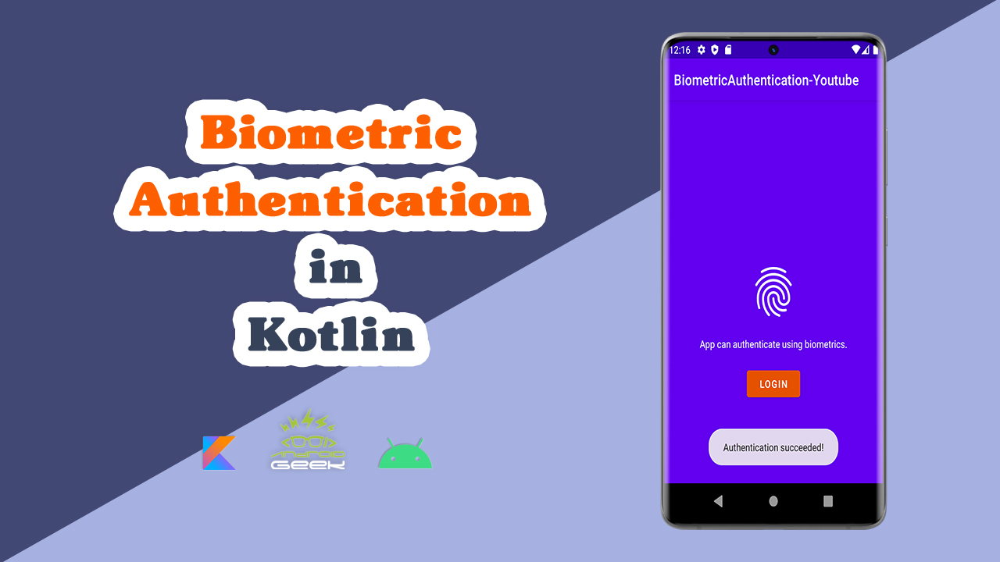

# BiometricAuthentication-Youtube
</a>

YouTube Video :
   

 

Medium's Article :
 
https://medium.com/@ezatpanah/how-to-use-biometric-authentication-in-kotlin-9885f372230f

✨ Join Medium to read thousands of valuable stories ✨
 
https://medium.com/@ezatpanah/membership

